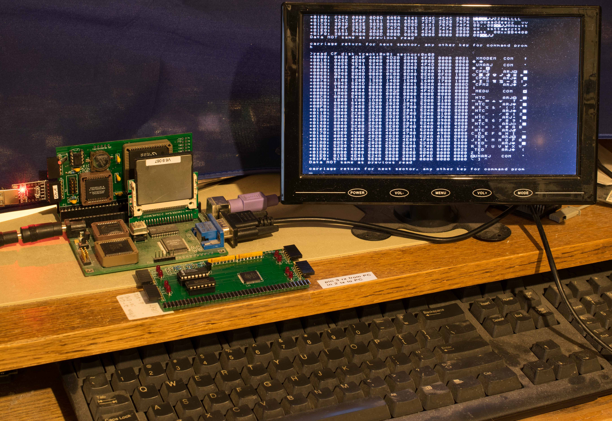
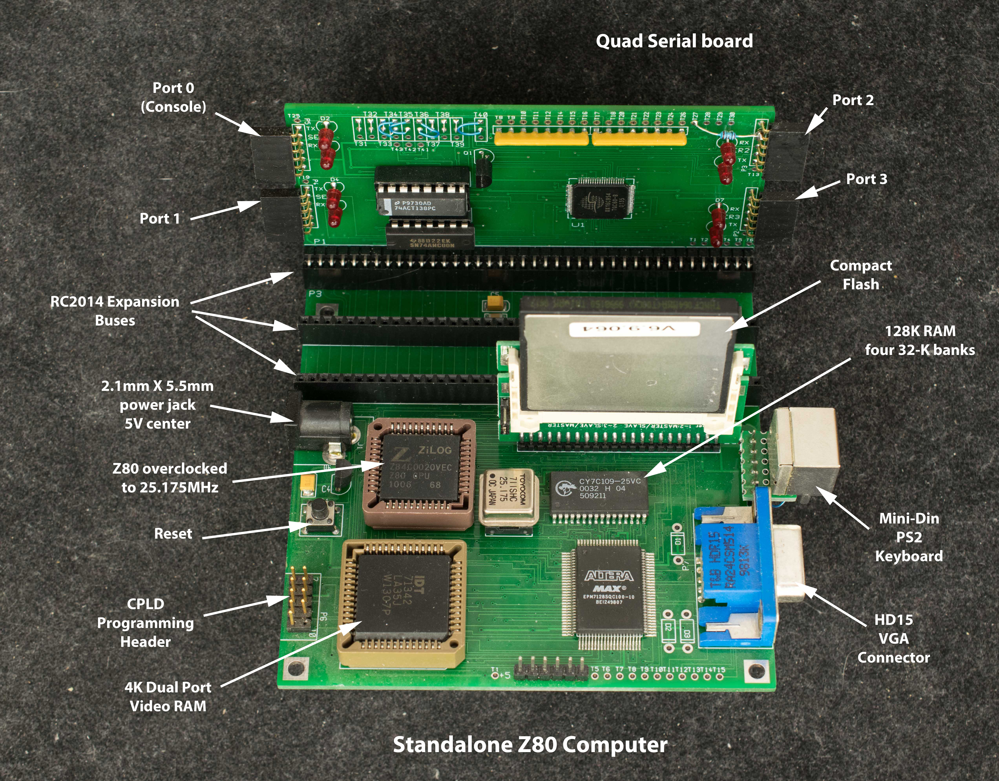
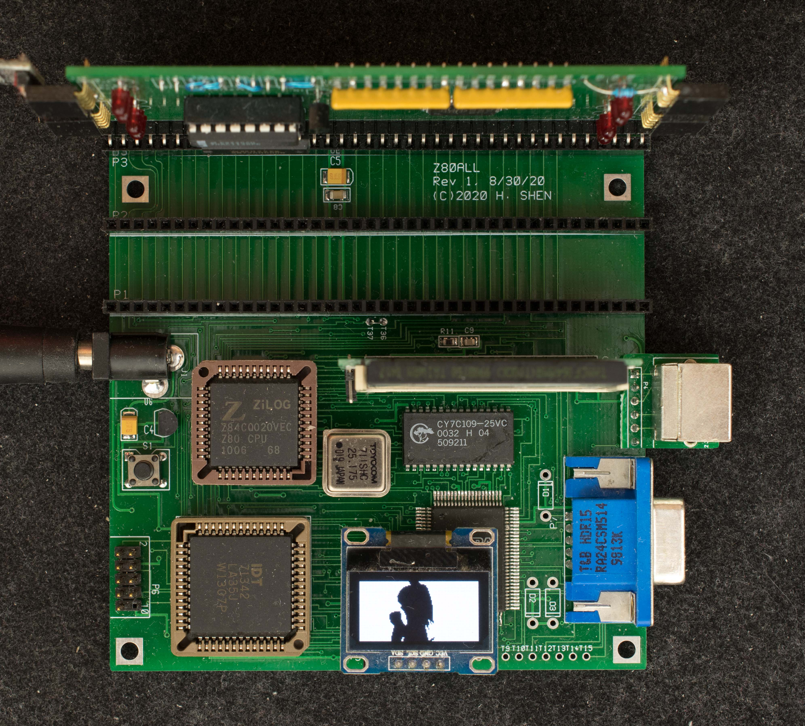
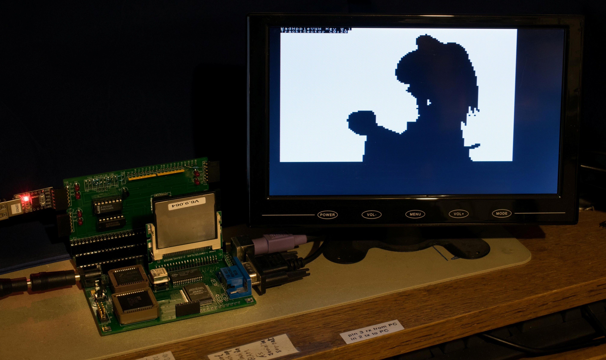
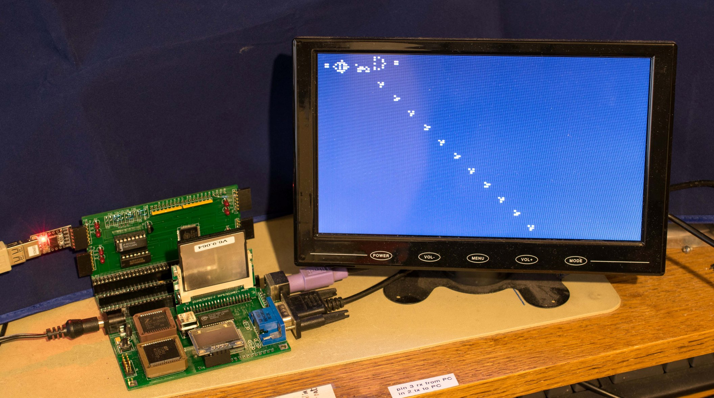

# Z80ALL with KIORC or QuadSer
**under construction, KIORC and Quadser boards need to be added into github repositories then linked here**

Z80all is a standalone Z80 CP/M computer that operates either by itself or with a quad serial board or a KIORC board. Operating by itself without expansion board it accepts inputs from PS2 keyboard and sends output to VGA monitor but has no data link to the outside world. With installation of either quad serial board or KIORC board, it will auto-detect the plug-in board and accepts inputs from either serial port or PS2 keyboard and sends outputs to both serial port and video. With a serial board, data can be loaded into Z80all using Intel Hex loader or XMODEM.

### Features
- Standalone Z80 computer with VGA display, PS2 keyboard, and 3 RC2014-compatible expansion slots
- Z80 overclocked to 25.175MHz
- 128K RAM divided into four 32K banks
- 512×480 monochrome text display
  - 60Hz VGA
  - 8 pixel x 8 pixel font
  - 64 columns by 48 rows of texts
  - Dynamically programmable fonts
- PS2 keyboard
- Compact flash disk
- Three RC2014 expansion slots
- CP/M 2.2 ready
- 5V @ 400mA
- Economical 100mm x 100mm 2-layer PC board
- Auto detect Quad Serial board or KIORC board

### Design Files
These are the links of schematic, Gerber photoplots, bill of materials for Z80all rev1, and Quadser board, and KIORC board.

- [CPLD design file for Z80all_rev1](../Z80ALL_rev1_rev2/z80all_rev1_2_standalone_60hz_irq_reverse_video.zip). Serial port function previously implemented in the CPLD is removed. PS2 controller is added. This CPLD design has no ability to do serial bootstrap and relies on CF disk to have the working software already installed. 60Hz interrupt added (2/18/2023)

- [Memory and I/O map](Memory_and_IO_Map.md) for standalone Z80all

- [Instruction](Update_KIO_instruction.md) for updating monitor for Z80all with KIORC

- [Bootstrap code in CPLD ROM](Bootstrap_code_in_CPLD_ROM.md) that copies CF's master boot record to 0xB000 and jump to 0xB000

- [KIO serial loader](software/z80all_kiorc_kio_serial_loader.zip) is for Z80ALL with KIORC serial board. The program is loaded at 0xB000 and typically used to update new monitor

### Software for Standalone Z80all or with Quad serial or KIORC board
Monitor will auto-detect either quad serial board or KIORC board. It can also operate without either boards. Please note the software are under active development so they can change and updated rapidly.

- [Monitor](software/z80all_monitor_v08_quadser_kiorc%20(1).zip)
- [CP/M2.2](software/cpm2_r1_3_require_quadser.zip)
- [CF image](software/z80all_kq_vga0x0_cpm1_8_monitor091.zip) for Z80all + Quad serial board
### BadApple!! Demo on Z80all
BadApple is animated shadow-art that can run on monochrome display like 128×64 OLED display or Z80all's monochrome display. This section describes the process of getting BadApple to run on either I2C-based 128×64 OLED display or on Z80all's monochrome VGA display. The original data file for BadApple is this full-length animated GIF file. The subsequent sections describe how the original data file is downsized to fit the targeted display, stored on CF disk, and the player software to display the data.

### Running BadApple on 128x64 OLED display
**Please note**, 128×64 OLED display may have different pin assignments. Z80ALL's I2C connector is hardwired to the following order of signals:

VCC GND SCL SDA

**Please verify your display's signal assignment is the above order before plugging it in.**

The original resolution of BadApple animated GIF is 360×270 in 4:3 aspect ratio but 128×64 OLED display is 2:1 aspect ratio. In order to keep the original aspect ratio, the image must be downsized to 85×64 resolution. Z80 also lacks the computation power to decode animated GIF and translate the image suitable to display on 128×64 OLED while keeping up the 20 frames/second video rate. The solution is to preprocess the original GIF file by

1. downsize to 85×64 GIF. This is done using online tool at ezgif.com to resize BadApple to 85x64
2. split to individual 85×64 frames. The online tool at ezgif.com can also split animated GIF to individual frames. There are 3109 frames in this zipped file.
3. convert each frame to data format for 128×64 OLED display. This is accomplished with online tool image2cpp by specifying 128×64 canvas size, plain bytes output format, and vertical - 1 bit per pixel draw mode.
4. Combine all frame sequentially into one contiguous file. Combining 3109 frames resulted in a large data file. EASy68K assembler is used to assemble it into Srecord and then into binary file with EASyBIN. The binary file is quite large, about 3.1meg.
5. Transfer the binary file to CF disk as one contiguous file. This is accomplished by first format drive D and then XMODEM the binary file to drive D. The 3.1meg file is stored starting from track 0xC0, sector 0x20.
6. Load and execute the BadApple player that reads the data from CF disk and output to OLED display at 20 frames/sec rate.
This [YouTube video](https://www.youtube.com/watch?v=TfivnP7DpYc) shows BadApple playing on a 128×64 OLED display hosted on Z80all.

### Running BadApple on text-based VGA monitor
Z80all’s VGA is 64×48 text mode only; 64×48 resolution is too low for most graphic applications. However, the fonts are programmable so 16 text characters (values 0x0-0xF) can be programmed to represent all permutations of 2×2 pixel array. This way the 64×48 resolution can be expanded to 128×96 which is sufficient to play BadApple in 128×96 resolution. The data file need to be preprocessed very similar to the 128×64 OLED example.

1. Downsize the original GIF file to 128x96 resolution using tools on ezgif.com.
2. Split the GIF file into 3109 images of 128×96 resolution.
3. convert each frame to data format of 128×96 canvas size, plain bytes output format, and vertical -1 bit per pixel draw mode.
4. Combine all frame sequentially into one contiguous file. Combining 3109 frames resulted in a large data file. EASy68K assembler is used to assemble it into Srecord and then into binary file with EASyBIN. The binary file is quite large, about 4.7meg.
5. Transfer the binary file to CF disk as one contiguous file. This is accomplished by first format drive D and then XMODEM the binary file to drive D. The 3.1meg file is stored starting from track 0xC0, sector 0x20.
6. Load and execute the BadApple player that reads the data from CF disk and output to VGA monitor at 20 frames/sec rate.
This [YouTube video](https://www.youtube.com/watch?v=KYVQk8Nyg84) shows 50 seconds of BadApple playing on Z80all's VGA monitor.

### Game of Life on VGA with 128x96 Universe
The default 64×48 VGA resolution is expanded to 128×96 by defining 16 set of fonts that represent all permutation of 2×2 sub-blocks. This enables Conway's Game of Life with an universe of 128×96 cells. This demonstration software is running Gosper Gun in 128×96 universe.

