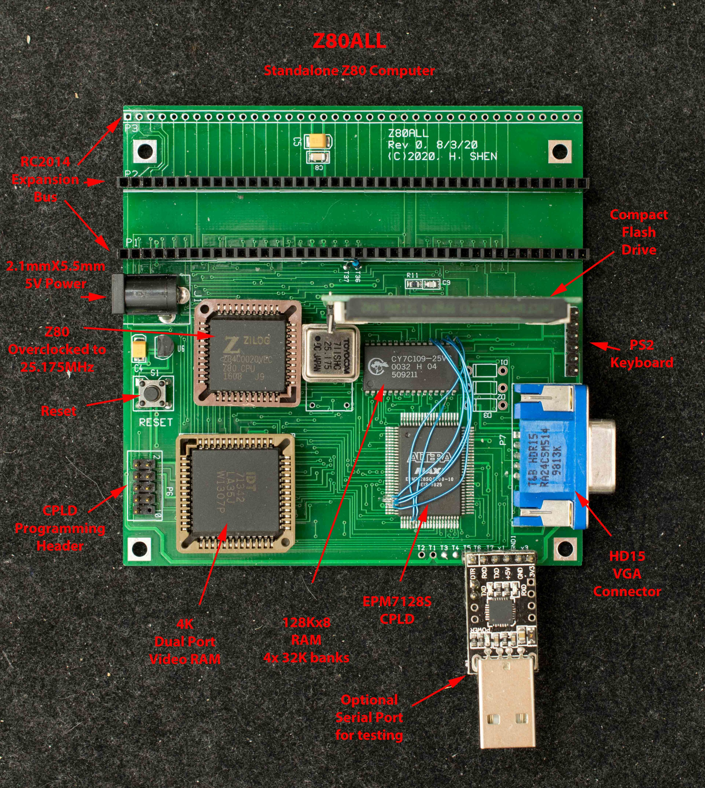

# Rev0 Z80ALL
Experimental version of Z80ALL
Z80ALL is my first attempt to build a standalone CP/M system. It is the combination of two previous designs, ZRCC and VGARC. The goal is an economical Z80 SBC with VGA and PS2 keyboard on a 4“x4” 2-layer pc board.

### Features
- Z80 overclocked to 25.175MHz
- 128K RAM in 4 32-K banks
- 4K dual port video RAM with user programmable font table.
- VGA monochrome interface, 64 columns X 48 rows
- EPM7128S CPLD with the following features
  - Small ROM to bootstrap from CF disk
  - VGA timing circuit
  - Serial port for hardware/software development
  - Memory bank select logic
  - Decoding logic for compact flash
- IDE44 interface for compact flash drive
- CP/M ready
- PS2 keyboard interface (not implemented)
- 3 RC2014 expansion bus
- Optional USB-serial connector
- 102mm X 102mm 2-layer pc board
- Nominal power consumption of 5V 300mA
### Theory of Operation
Z80ALL boots through the 32-byte ROM embedded in the CPLD which loads and executes code on compact flash's Master Boot Block; which, in turn, loads and executes a monitor located in Track 0 of compact flash; thus the CF disk serves as the traditional EPROM loading code into RAM and executing in RAM.

The VGA interface is through a 4Kx8 dual port RAM. One side of the dual port RAM is read/write accessible by Z80 as 4K I/O space. 3K of the I/O space maps to each character of the 64×48 display; the top 1K is font lookup table for characters 0x0-0x7F. Z80 can read/write to its side of dual port RAM anytime without affecting video display quality. The other side of the dual port RAM is read only accessible by VGA timing circuit in CPLD. It reads each character and looks up corresponding font and output the pixel representation of the character on RGB output. This is a monochrome display.

### Design Information
- Schematic
- Gerber photoplots
- CPLD design

### Software
- Bootstrap ROM in CPLD, this 64-byte bootstrap can boot from serial or CF disk
- Simple ROM bootstrap, this 32-byte bootstrap always boot from CF disk
- Serial Loader resides in compact flash's Master Boot Record
- Z80ALL monitor
- CP/M 2.2 BIOS/CCP/BDOS

### Demo
Game of Life
This is a video of Conway's Game of Life running on Z80ALL. The software itself is only 500 bytes, it takes advantage of the read/write capability of the video memory and perform required calculations directly on the video memory. The dual port memory impose no restriction on Z80's access and the display quality is not at all affected by the numerous Z80 read/write access. http://https://youtu.be/qt8Mx9dZJj0

Scroll Test
The VGA circuit in Z80ALL is simple; it does not have hardware scroll function. To scroll a line, the entire screen needs to be read and re-written with one line offset. This may seems a slow process, but because there are only 3K characters in consecutive I/O addresses, the operation can be done with INDR and OTDR instructions. https://www.youtube.com/watch?v=Dg1U_u5plDk

