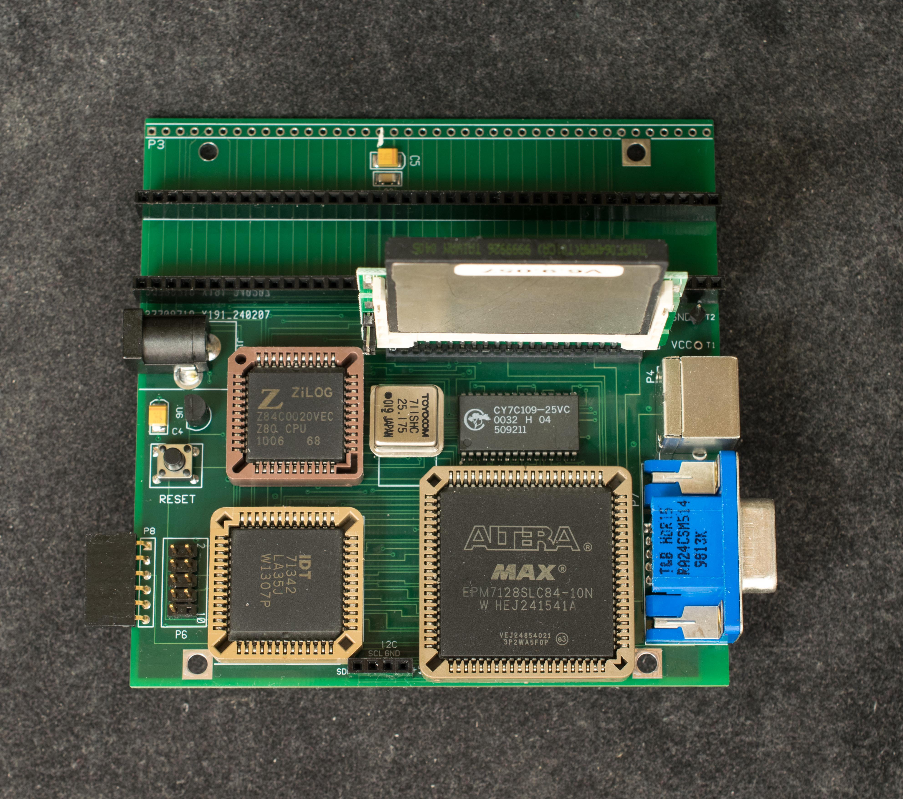

# Rev3 Z80ALL
Z80ALL rev3 is very similar to Z80ALL rev2 except the CPLD is redesigned in PLCC84 package which is cheaper and easier to assemble

### Features
- Z80 overclocked to 25.175MHz
- 128K RAM in 4 32-K banks
- 4K dual port video RAM with user programmable font table.
- VGA monochrome interface, 64 columns X 48 rows
- Easy to assemble EPM7128S in PLCC84 package
- EPM7128S CPLD with the following features
  - Small ROM to bootstrap from CF disk
  - VGA timing circuit
  - Serial port for hardware/software development
  - Memory bank select logic
  - Decoding logic for compact flash
- IDE44 interface for compact flash drive
- CP/M ready
- PS2 keyboard interface
- 3 RC2014 expansion bus
- Optional USB-serial connector
- 102mm X 102mm 4-layer pc board
- Nominal power consumption of 5V 300mA
### Theory of Operation
Z80ALL boots through the 32-byte ROM embedded in the CPLD which loads and executes code on compact flash's Master Boot Block; which, in turn, loads and executes a monitor located in Track 0 of compact flash; thus the CF disk serves as the traditional EPROM loading code into RAM and executing in RAM.

The VGA interface is through a 4Kx8 dual port RAM. One side of the dual port RAM is read/write accessible by Z80 as 4K I/O space. 3K of the I/O space maps to each character of the 64×48 display; the top 1K is font lookup table for characters 0x0-0x7F. Z80 can read/write to its side of dual port RAM anytime without affecting video display quality. The other side of the dual port RAM is read only accessible by VGA timing circuit in CPLD. It reads each character and looks up corresponding font and output the pixel representation of the character on RGB output. This is a monochrome display.

### Design Files
- [Schematic](z80all_rev3_scm.pdf)
- [Gerber photoplots](z80all_r3_gerber.zip)
- [CPLD design](z80all_rev3pcb_cpld_84plcc_design_file.zip) files ← updated 4/2/24 to fix missing VGA connector pads in ground layer
- Bill of Materials
- [Memory and I/O map](Memory_and_IO_Map.md)

### Software
Z80ALL rev3 software is same as [Z80ALL rev1_rev2 software](../Z80ALL_rev1_rev2/Software)
